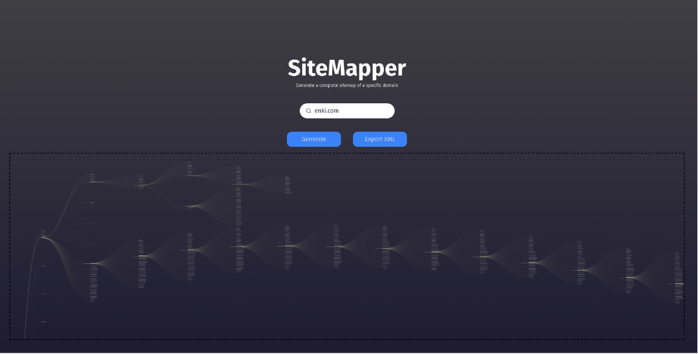

<h1 align="center">Project Web Crawler</h1>
<br />

## 🗂 Contents

- 📋 [Project](#-project)
  - 🚀 [Technologies](#-technologies)
  - 🧮 [Diagram](#-diagram)
  - 🌐 [Prototype](#-prototype)
  - 📷 [Preview](#-preview)
- 📦 [Installation](#-installation)
- ⚖️ [License](#%EF%B8%8F-license)
- 📫 [Contact](#-contact)

## 📋 Project

This project involved the development of a web crawler that delves into a specific domain to extract all internal links, creating a sitemap of the content. In the <em>"front-end"</em>, users can input the domain they wish to crawl. Upon completion of the crawling process, a tree-graph view of the results is generated, which can also be exported to a sitemap XML file.

## 🚀 Technologies

[](https://typescriptlang.org)
[](https://nodejs.org)
[](https://react.dev)
[](https://fastify.io)
[](https://vitejs.dev)
[](https://tailwindcss.com)
[](https://tanstack.com/query/latest)
[](https://www.npmjs.com/package/@enkidevs/axios-sisyphus)
[](https://www.d3js.org)
[](https://www.npmjs.com/package/xml)
[](https://www.npmjs.com/package/p-queue)
[](https://pptr.dev)
[](https://vitest.dev)
[](https://playwright.dev)
[](https://testing-library.com)
[](https://www.docker.com)

## 🧮 Diagram:

<p align="center"> 
  
</p>

## 🌐 Prototype

https://sitemapper.net

## 📷 Preview

<p align="center"> 
  
</p>

## 📦 Installation

To clone and run this application, you will need [Git][git], [NodeJS][nodejs] and [npm][npm] installed on your computer. In your terminal, run:


```bash
# Cloning repo
$ git clone https://github.com/sagelabs/bruno-duarte-interview.git sitemapper
```

```bash
# Back-end

# Go to the repository
$ cd server

# Install the dependencies
$ npm install

# Run the API
$ npm run dev

# Note: After running the command above, the API will be available at http://localhost:3000

```

```bash
# Front-end

# Got to the repository
$ cd web

# Install the dependencies
$ npm install

# Start the application 
$ npm run dev
```

## ⚖️ License

This project is under license. [MIT](LICENSE).

## 📫 Contact

by [**Bruno S. Duarte**](https://www.linkedin.com/in/brunosduarte/) 🚀

[git]: https://git-scm.com
[nodejs]: https://nodejs.org/
[npm]: https://www.npmjs.com/