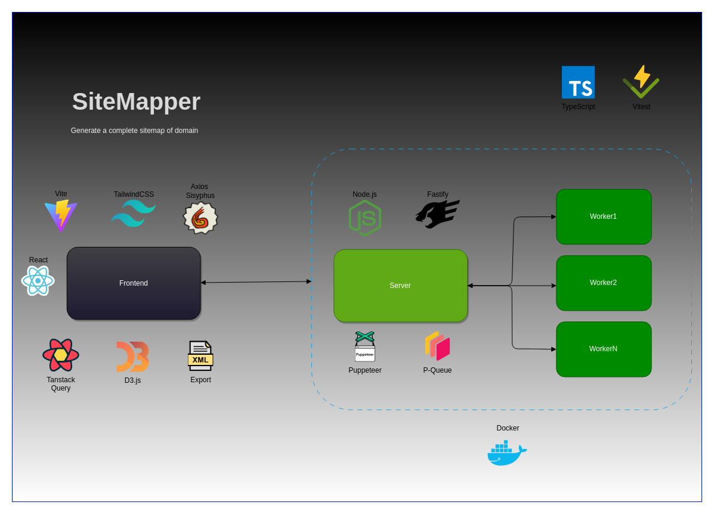
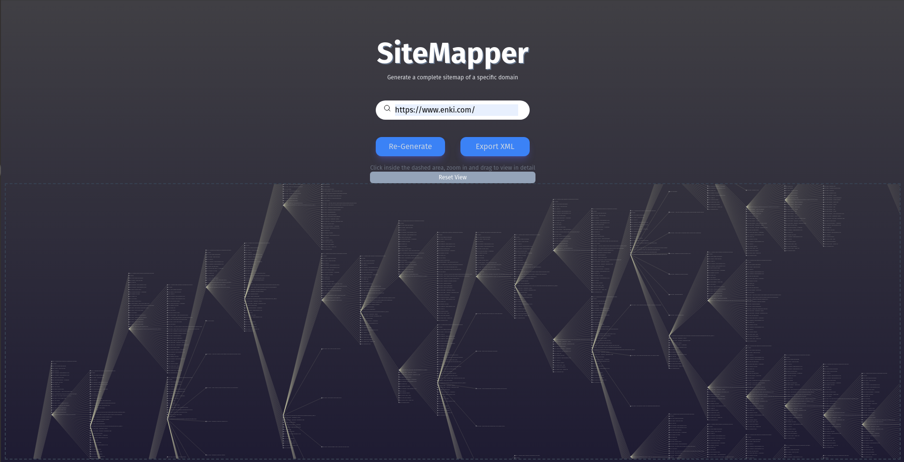

<h1 align="center">Project Web Crawler</h1>
<br />

## 🗂 Contents

- 📋 [Project](#-project)
  - 🚀 [Technologies](#-technologies)
  - 🧮 [Diagram](#-diagram)
  - 🌐 [Prototype](#-prototype)
  - 📷 [Preview](#-preview)
- 📦 [Installation](#-installation)
- ⚖️ [License](#%EF%B8%8F-license)
- 📫 [Contact](#-contact)

## 📋 Project

In this project was implemented a web crawler that dig into a domain and extract all internal links generating a sitemap with the content.
On the <em>"Frontend"</em> you insert the domain, this information is sent to the <em>"Server"</em> that crawl the website and generate a list of links.
The process to dig into the website is made on server, spreading the job to <em>"Workers"</em> that pick up the list of founded links in the root page and distribute the job with .
For the job operation between <em>"Workers"</em> and <em>"Server"</em> was used the concept of 
When the <em>"Server"</em> gives back the result to the <em>"Frontend"</em> is generated a Tree view of the results using the library D3.js.
Click on the button <strong>"Export"<strong> and download a <strong>Sitemap XML file</strong>.

## 🚀 Technologies

[](https://typescriptlang.org)
[](https://nodejs.org)
[](https://react.dev)
[](https://www.expressjs.com)
[](https://vitejs.dev)
[](https://tanstack.com/query/latest)
[](https://www.npmjs.com/package/@enkidevs/axios-sisyphus)
[](https://tailwindcss.com)
[](https://www.d3js.org)
[](https://www.npmjs.com/package/xml)
[](https://www.npmjs.com/package/p-queue)
[](https://pptr.dev)
[](https://vitest.dev)
[](https://playwright.dev)
[](https://testing-library.com)

- Future implementations
[](https://www.redis.io)
[](https://www.docker.com)

## 🧮 Diagram:

<p align="center"> 
  
</p>

## 🌐 Prototype

https://sitemapper.net

## 📷 Preview

<p align="center"> 
  
</p>

## 📦 Installation

To clone and run this application, you will need [Git][git], [NodeJS][nodejs] and [npm][npm] installed on your computer. In your terminal, run:


```bash
# Cloning repo
$ git clone https://github.com/sagelabs/bruno-duarte-interview.git sitemapper
```

```bash
# Server

# Go to the repository
$ cd server

# Install the dependencies
$ npm install

# Run the API
$ npm run dev

# Note: After running the command above, the API will be available at http://localhost:3000

```

```bash
# Frontend

# Got to the repository
$ cd web

# Install the dependencies
$ npm install

# Start the application 
$ npm run dev
```

## ⚖️ License

This project is under license. [MIT](LICENSE).

## 📫 Contact

by [**Bruno S. Duarte**](https://www.linkedin.com/in/brunosduarte/) 🚀

[git]: https://git-scm.com
[nodejs]: https://nodejs.org/
[npm]: https://www.npmjs.com/